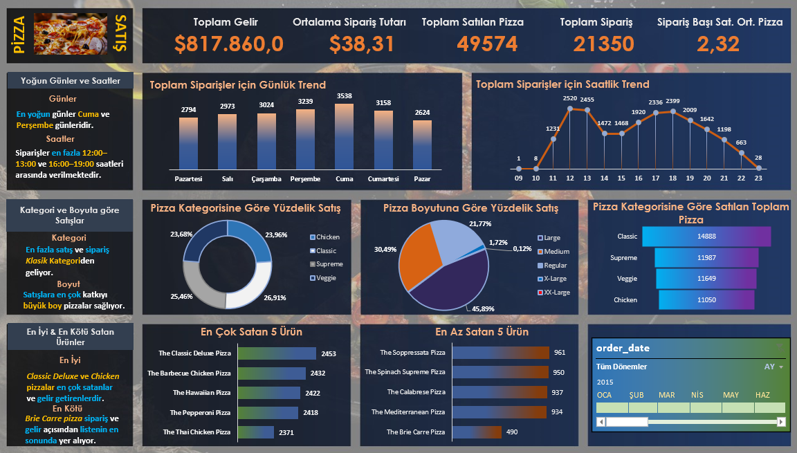

# 🍕 Pizza Satış Dashboard'u & SQL Analizi

Merhaba,
Ben Osman Umut Kara. Veri Analizi ve İş Zekası (Business Intelligence) alanında kariyer hedefliyorum. Bu hedef doğrultusunda yeteneklerimi geliştirmek adına çeşitli projeler üzerinde çalışıyorum.

Bu projelerden birini sizlerle paylaşmak isterim.

Bu proje, pizza satış verilerini analiz ederek karar vericilere değerli içgörüler sunmayı amaçlamaktadır.
Satış verileri üzerinde **SQL Server** kullanılarak sorgular çalıştırılmış ve görselleştirme için **Excel**'de etkileşimli bir dashboard oluşturulmuştur.

Dashboard aracılığıyla şu içgörüler elde edilmiştir:
* En yoğun satış günleri ve saatleri
* En çok ve en az satan pizzalar
* Kategori ve boyuta göre satış dağılımı

## 📊 Dashboard

---

### 📌 Proje Özeti

**KPI'lar:** Toplam Gelir, Ortalama Sipariş Değeri, Satılan Toplam Pizza, Toplam Sipariş Sayısı, Sipariş Başına Ortalama Pizza Sayısı

**Analizler:** Günlük Trend, Saatlik Trend, Kategoriye Göre Satış (%), Boyuta Göre Satış (%), En Çok & En Az Satan Ürünler

### 🧰 Kullanılan Araçlar

* **SQL Server (T-SQL)**
* **Microsoft Excel** (Pivot Grafikler & Dashboard)

### Temel Çıktılar

* En yoğun satış günleri ve saatleri belirlendi.
* Hangi kategori ve boyutların en iyi performansı gösterdiği analiz edildi.
* En çok ve en az satan ürünler listelendi.
* Karar vericiler için etkileşimli bir dashboard tasarlandı.

---
*Bu proje, Data Tutorials YouTube kanalındaki “SQL & Excel Portfolio Project | Data Analyst Portfolio Project | Excel Project” videosu referans alınarak geliştirilmiştir.*

